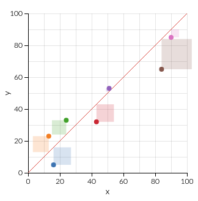
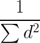
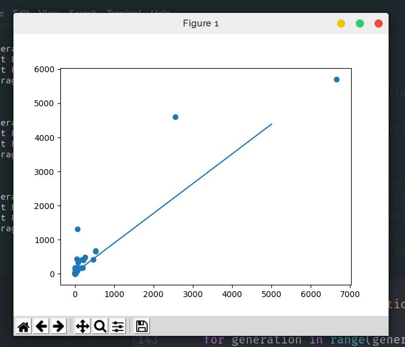

# OrdinaryLeastSquares-GeneticAlgorithm
Regression using Ordinary Least Squares where the line equation is optimised using a genetic algorithm

## OLS
Ordinary Least Squares regression aims to find the line of best fit by minimising the vertical distance squared between the data point and the line.

Here is a visual representation of the squares which's area you are attempting to minimise through a line of best fit:


## Genetic Algorithm
To apply a genetic algorithm to a problem to find the local optimal, you have to have 3 basic things:

#### 1. A (large) Population
For the genetic algorithm, you need to have a large varying population so you can find a solution in the widest range possible in other words you need a large variety of traits present in the population to find the optimal one, this means that you have to randomly generate each line of best fit by creating two floats which was the gradient and the Y intercept.

This was probably the easiest step to implement and was done in my code by just having a for loop that works inside the population size and creates an Equation object with the two basic properties mentioned above.

```python
population = []
for n in range(num):
    gradient = ranFloat(maxG, minG)
    intercept = ranFloat(maxI, minI)
    population.append(Equation(gradient, intercept))
return population
```
#### 2. Heredity
Heredity is the passing down of genes in one generation to another, this is required for evolution since you need heredity to make sure there's selected heredity

This was also easy to implement. When I pick two lines to breed, I simply take the average of the gradient and the average of the Y intercept and create a new Equation which joins the next population.

```python
def chooseParents(population):
    Pair = collections.namedtuple('Point', ['p1', 'p2'])
    parents = []
    nfitness = []
    for equation in population:
        nfitness.append(equation.nfitness)
    for i in range(0, len(population)):
        p1 = pickByFitness(population, nfitness)
        p2 = pickByFitness(population, nfitness)
        parents.append(Pair(p1, p2))
    return parents
```
The first function picks parents (not randomly) from the current population and creates a Pair struct-like object, to make sure the population size stays the same size, I implemented a for loop that has a range of the current population size. After creating a list of the Pair struct it passes it to a second function.

```python
def breed(parents):
    npopulation = []
    for pair in parents:
        ngradient = average(pair.p1.gradient, pair.p2.gradient)
        nintercept = average(pair.p1.intercept, pair.p2.intercept)
        child = Equation(ngradient, nintercept)
        child.mutate(MUTATION_RATE)
        npopulation.append(child)
    return npopulation
```
All the second function does is takes all the pairs and creates off-springs by averaging out the two parents and returns a brand new population of children.

When breeding, it is also recommended to have a mutation function, this means that it is still possible to reach optimum solution even if the solution is not possible with the starting population.

Doing this for equations was pretty simple, if a randomly generated float is below the mutation paramater, you change the gradient and y intercept of the line.

I did this by adding a function to the equation object and called it every time a new equation was created.

```python
def mutate(self, rate):
    if ranFloat(0, 1) < rate:
        self.gradient += ranFloat(MAXIMUMGRADIENT, MINIMUMGRADIENT)
        self.intercept += ranFloat(MAXIMUMINTERCEPT, MINIMUMINTERCEPT)
```

#### 3. Selection in Heredity

Selection in a genetic algorithm is by far the most important step since it allows the population to actually improve over time. The concept behind this is the exact same as real life:

- The strong have more children
- The weak have less children
- Therefore the second generation is more like the strong
- Therefore the second generation is stronger and there is improvement

In the same way, in my problem:
- Accurate line of best fits have more children
- The less accurate have less children
- Therefore the second generation is more like the strong
- Therefore, in general, the second generation of equations are more Accurate

To engineer this process you need a way to select which lines are the best and make them more likely to breed. To do this, you have to have what's called a fitness function, in this particular problem, the fitness function is:



###### Note: In this function, d is the vertical distance between the data point and the line

The function works by summing up the total area of all the "squares" created from the data points to the line. Since the area of the squares decrease as the line's accuracy increases, you have to take the reciprocal of the total area. This way, the function goes up as the area of squares decreases.

```python
def calculateDistance(self, point):
    distance = point.y - ( self.gradient * point.x ) + self.intercept
    return distance

def calculateFitness(self, points_array):
    for point in points_array:
        self.fitness += self.calculateDistance(point) ** 2
    self.fitness = (1 / self.fitness) ** 3
```
To implement it, I gave each Equation object a fitness variable and a method to calculate its own fitness by passing in an array of all the datapoints to the function.

One of the tricks to improve the speed of a genetic algorithm is to manipulate the fitnesses in a way that the fit get fitter and the not-so-fit get relatively less fit. To do this, I cube each fitness as seen in the line:

```python
self.fitness = (1 / self.fitness) ** 3
```
This means that the fit ones get much relatively much fitter and the less fit ones get relatively less fit. This then speeds up the evolution process since this is the equivalent of the strong having even more children and the weak having even less children.

To implement the selective into the breeding, I normalized each fitness to 1. This means that I can use each Equation's normalized fitness like a probability since in total they add up to 1.

```python
def pickByFitness(population, nfitness):
    return numpy.random.choice(population, p=nfitness)

def chooseParents(population):
    Pair = collections.namedtuple('Point', ['p1', 'p2'])
    parents = []
    nfitness = []
    for equation in population:
        nfitness.append(equation.nfitness)
    for i in range(0, len(population)):
        p1 = pickByFitness(population, nfitness)
        p2 = pickByFitness(population, nfitness)
        parents.append(Pair(p1, p2))
    return parents
```
I created an array of all the normalized fitnesses and passed them to a handy function in numpy which picks randomly from an array using the probalities. Since the more accurate lines have a higher normalized fitness, they also have a higher probability of being picked leading to the next generation being more like them so when they are breeded, the next generation in turn also becomes more accurate.


This step of selective heredity is repeated over and over again lots leading to a line which has succesfully minimised the misrepresentation of the data leading to higher accuracy when predicting.

#### Advantages of using a genetic algorithm for regression

It is easy to implement, in just over 100 lines I was able to create a general solution to all linear regression problems.

It is highly flexible since it has quite a few parameters that you can tinker. This means that it can solve a variety of problems you may throw at it.

It is a general solution, you just need to change a few functions and this basic framework can be used to solve non-linear regression and even different problems in which there is a maxima and minima and a fitness function.

#### Problems

My main problem with implementing the genetic algorithm is that it isn't very accurate over a short period of time, maybe if ran long enough it is more accurate than traditional techniques but in just 50 generations I saw promising results.

Another problem is that it isn't reliable, you won't get the same result if you run it twice because the genetic algorithm is heavily based on randomisation and probability when choosing off springs and generating the initial population.

All this work lead to a final satisfying screenshot of my Ordinary Least Squares tool using the genetic algorithm working out a line of best fit for the data points of brain weight vs body weight:



Enjoy!
